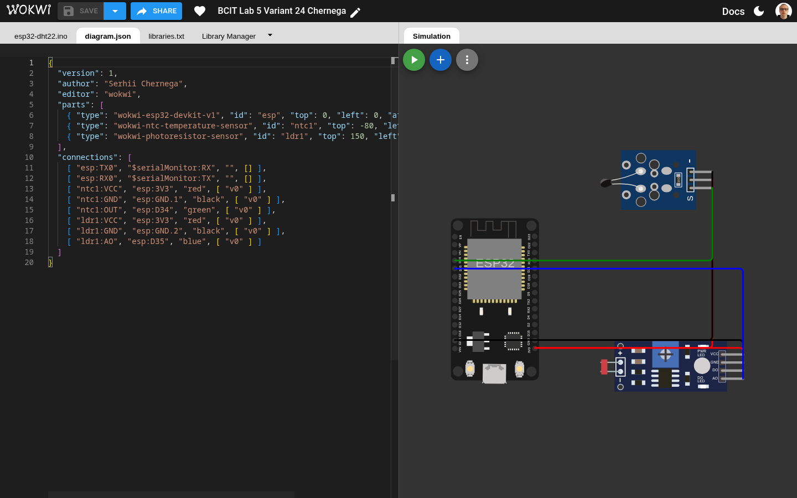
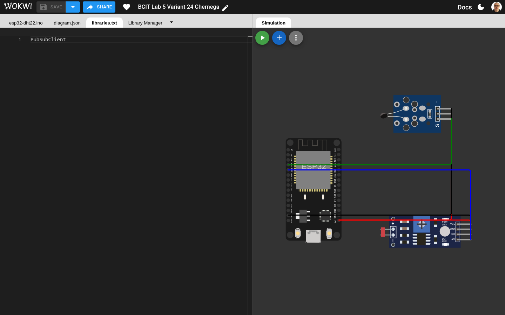
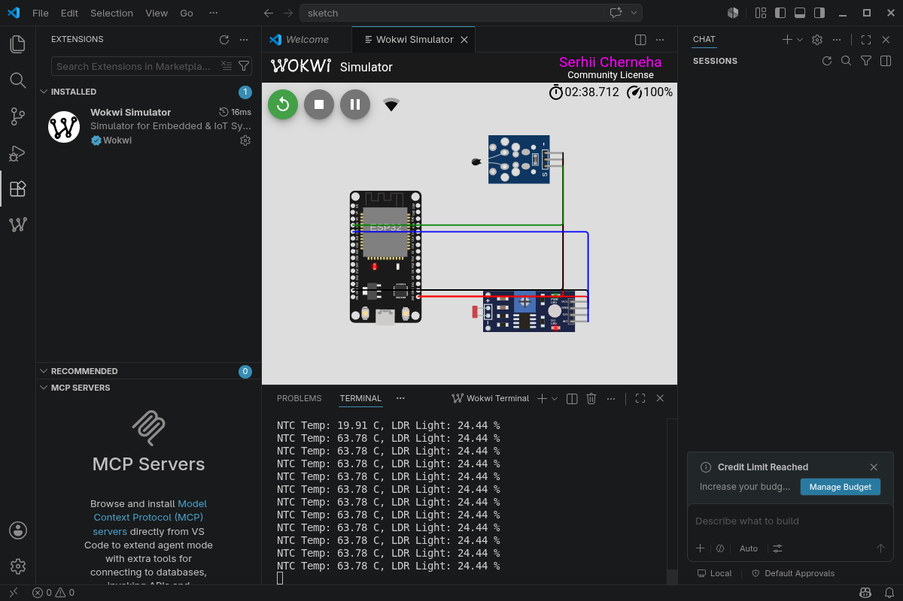
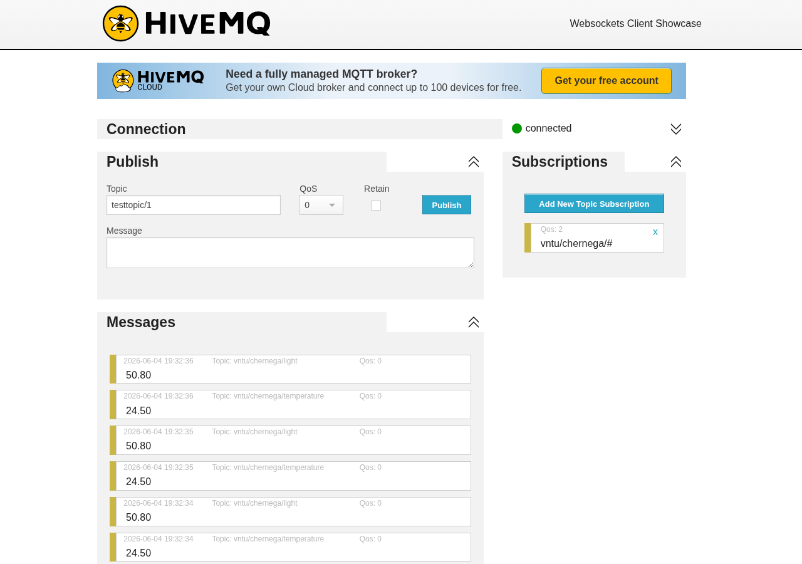
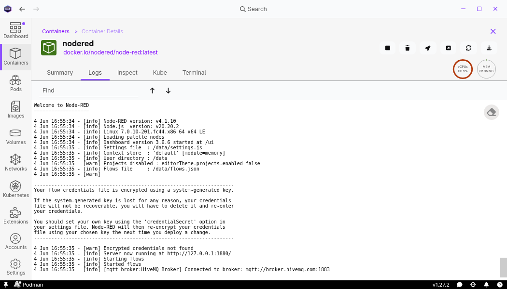
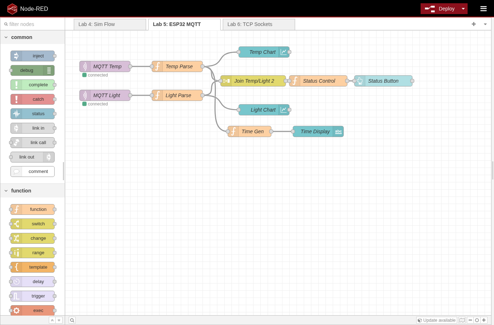
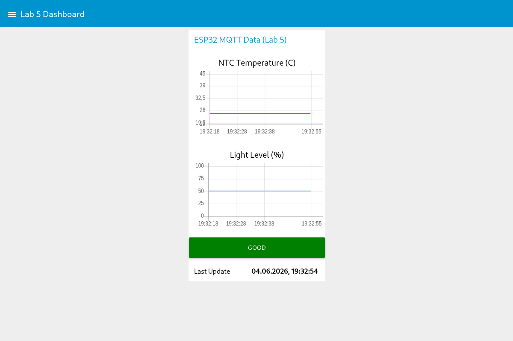
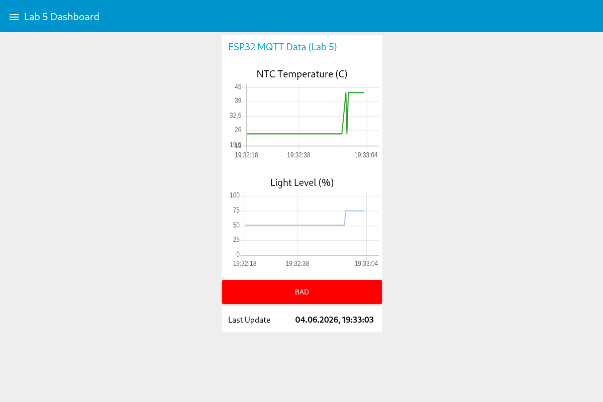

# Lab Work 5: ESP32 IIoT System Modeling with MQTT

This project is a laboratory work for the "Fundamentals of Computer-Integrated Technologies" course.

## Description

The lab covers modeling a fragment of an IIoT automation system based on the ESP32 microcontroller. It includes reading analog sensors (NTC thermistor for temperature and LDR photoresistor for light level), publishing data via MQTT to a HiveMQ broker, and visualizing the data in a Node-RED dashboard with real-time charts and status indicators.

The monitoring system applies hysteresis-based status control (GOOD/BAD thresholds) for both temperature and light level.

## Prerequisites

- Fedora Linux (or any Linux distribution with Podman support)
- Podman installed and configured
- Wokwi simulator account (https://wokwi.com)

## How to Set Up and Run

### 1. Open the Wokwi Project

The ESP32 firmware is designed to run in the Wokwi simulator. Open the project diagram and flash the firmware:

```
https://wokwi.com/projects/465915722093216769
```

For detailed instructions on compiling and flashing the firmware to a physical ESP32, see [sketch/README.md](sketch/README.md).







### 2. Sensors Configuration (Variant 24)

Two analog sensors are connected to the ESP32:

- **NTC Thermistor** (GPIO 34) — Temperature measurement using the Steinhart-Hart equation with Beta coefficient 3950
- **LDR Photoresistor** (GPIO 35) — Light level mapping to 0-100% range

### 3. MQTT Data Publishing

The firmware connects to WiFi and publishes sensor data every second:

- Topic: `vntu/chernega/temperature` — Temperature in Celsius
- Topic: `vntu/chernega/light` — Light level in percentage

Broker: `broker.hivemq.com:1883`

### 4. Monitor via HiveMQ WebSocket

Subscribe to `vntu/chernega/#` on the HiveMQ WebSocket Client to verify data reception:

```
https://www.hivemq.com/demos/websocket-client/
```



### 5. Node-RED Dashboard



A pre-built flow file is available at [`flows/lab5.json`](flows/lab5.json). To import it:

1. In the Node-RED editor, go to the menu (≡) → Import → Clipboard
2. Paste the contents of `flows/lab5.json` and click Import
3. Click Deploy to activate the flow

The flow subscribes to MQTT topics and displays:



- Real-time temperature and light charts
- Status control with hysteresis:
  - **GOOD** when T ≤ 34.4 AND L ≤ 64.4
  - **BAD** when T > 40.4 OR L > 70.4

Access the dashboard at:

```
http://127.0.0.1:1880/ui/
```

## Example Usage

After flashing the firmware and deploying the Node-RED flow, the HMI interface displays:

- Real-time temperature and light level charts updating every second
- A status indicator showing GOOD (green) or BAD (red) based on current sensor values





## Contributing

Contributions are welcome and appreciated! Here's how you can contribute:

1. Fork the project
2. Create your feature branch (`git checkout -b feature/AmazingFeature`)
3. Commit your changes (`git commit -m 'Add some AmazingFeature'`)
4. Push to the branch (`git push origin feature/AmazingFeature`)
5. Open a Pull Request

Please make sure to update tests as appropriate and adhere to the existing coding style.

## License

This project is licensed under the CSSM Unlimited License v2.0 (CSSM-ULv2). See the [LICENSE](LICENSE) file for details.
